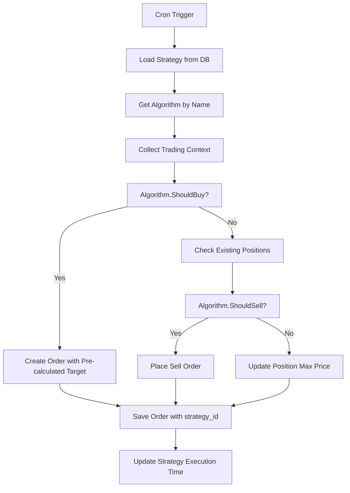

# Architecture Révisée et Simplifiée - Stratégies Multiples

## 🎯 Nouvelle Vision Architecturale

Suite à vos excellentes remarques, voici une approche **beaucoup plus simple et élégante** :

### 1️⃣ **Configuration = DB-First + Algorithmes Extraits**
### 2️⃣ **Pas de table strategies complexe**
### 3️⃣ **Strategy Pattern pour les algorithmes**

## 🏗️ Architecture Simplifiée

### Configuration Fichier (Minimal)
```yaml
# config.yml - MINIMAL
exchange:
  name: hyperliquid

database:
  path: db/bot.db

logging:
  level: info
  file: ""

web:
  port: ":8080"

global:
  pair: UBTC/USDC
  check_interval_minutes: 5
```

### Configuration Stratégies (Base de Données)
```sql
-- Table strategies (SIMPLIFIÉE)
CREATE TABLE strategies (
    id INTEGER PRIMARY KEY AUTOINCREMENT,
    name TEXT UNIQUE NOT NULL,
    description TEXT,
    enabled BOOLEAN DEFAULT 1,
    
    -- Paramètres de la stratégie
    cron_expression TEXT NOT NULL,
    quote_amount REAL NOT NULL,
    rsi_threshold REAL NOT NULL,
    rsi_period INTEGER NOT NULL,
    profit_target REAL NOT NULL,
    volatility_period INTEGER NOT NULL,
    volatility_adjustment REAL NOT NULL,
    trailing_stop_delta REAL NOT NULL,
    sell_offset REAL NOT NULL,
    max_concurrent_orders INTEGER DEFAULT 1,
    
    -- Algorithme à utiliser
    algorithm_name TEXT NOT NULL DEFAULT 'rsi_dca',
    
    -- Scheduling
    last_executed_at DATETIME NULL,
    next_execution_at DATETIME NULL,
    
    -- Timestamps
    created_at DATETIME DEFAULT CURRENT_TIMESTAMP,
    updated_at DATETIME DEFAULT CURRENT_TIMESTAMP
);

-- Pas besoin de JSON, tout est en colonnes explicites
```

## 🔧 Extraction des Algorithmes (Strategy Pattern)

### Structure des Algorithmes
```
internal/
├── algorithms/
│   ├── algorithm.go        # Interface Strategy
│   ├── rsi_dca.go         # Algorithme RSI + DCA (existant)
│   ├── bollinger_bands.go # Nouvel algorithme (futur)
│   ├── ema_cross.go       # Nouvel algorithme (futur)
│   └── registry.go        # Registre des algorithmes
```

### Interface Algorithm
```go
// internal/algorithms/algorithm.go
package algorithms

type TradingContext struct {
    CurrentPrice   float64
    RSI           float64
    Volatility    float64
    Balance       map[string]float64
    OpenPositions []database.Position
}

type BuySignal struct {
    ShouldBuy    bool
    Amount       float64
    LimitPrice   float64
    TargetPrice  float64  // PRÉ-CALCULÉ ici !
    Reason       string
}

type SellSignal struct {
    ShouldSell  bool
    LimitPrice  float64
    Reason      string
}

type Algorithm interface {
    Name() string
    Description() string
    
    // Logique d'achat
    ShouldBuy(ctx TradingContext, strategy database.Strategy) (BuySignal, error)
    
    // Logique de vente (mise à jour des positions existantes)
    ShouldSell(ctx TradingContext, position database.Position, strategy database.Strategy) (SellSignal, error)
    
    // Validation de la configuration
    ValidateConfig(strategy database.Strategy) error
}
```

### Algorithme RSI-DCA (Code Existant Extrait)
```go
// internal/algorithms/rsi_dca.go
package algorithms

type RSI_DCA struct{}

func (a *RSI_DCA) Name() string { return "rsi_dca" }
func (a *RSI_DCA) Description() string { return "RSI-based Dollar Cost Averaging" }

func (a *RSI_DCA) ShouldBuy(ctx TradingContext, strategy database.Strategy) (BuySignal, error) {
    // Logique RSI existante extraite de bot.go
    if ctx.RSI > strategy.RSIThreshold {
        return BuySignal{ShouldBuy: false, Reason: "RSI too high"}, nil
    }
    
    // Calculer le prix d'achat dynamique (existant)
    dynamicOffsetPercent := -((0.1 / 100.0) + (ctx.RSI/100.0)/100.0)
    dynamicOffset := ctx.CurrentPrice * dynamicOffsetPercent
    limitPrice := ctx.CurrentPrice + dynamicOffset
    
    // PRÉ-CALCULER le prix cible ici ! 
    volatilityFactor := (ctx.Volatility - strategy.ProfitTarget) / 100.0
    adjustmentPercent := volatilityFactor * (strategy.VolatilityAdjustment / 100.0)
    dynamicProfitPercent := (strategy.ProfitTarget / 100.0) + adjustmentPercent
    targetPrice := limitPrice * (1.0 + dynamicProfitPercent)
    
    return BuySignal{
        ShouldBuy:   true,
        Amount:      strategy.QuoteAmount / limitPrice,
        LimitPrice:  limitPrice,
        TargetPrice: targetPrice,  // ✅ PRÉ-CALCULÉ !
        Reason:      fmt.Sprintf("RSI %.2f < threshold %.2f", ctx.RSI, strategy.RSIThreshold),
    }, nil
}

func (a *RSI_DCA) ShouldSell(ctx TradingContext, position database.Position, strategy database.Strategy) (SellSignal, error) {
    // Logique trailing stop existante extraite de bot.go
    if ctx.CurrentPrice >= position.TargetPrice {
        trailingStopThreshold := 1.0 - (strategy.TrailingStopDelta / 100)
        if ctx.CurrentPrice < (position.MaxPrice * trailingStopThreshold) {
            priceOffset := ctx.CurrentPrice * (strategy.SellOffset / 100.0)
            limitPrice := ctx.CurrentPrice + priceOffset
            
            return SellSignal{
                ShouldSell: true,
                LimitPrice: limitPrice,
                Reason: fmt.Sprintf("Trailing stop triggered: %.4f < %.4f", 
                    ctx.CurrentPrice, position.MaxPrice * trailingStopThreshold),
            }, nil
        }
    }
    
    return SellSignal{ShouldSell: false}, nil
}
```

## 📊 Base de Données Ultra-Simplifiée

### Schema Final
```sql
-- Migration 6: Table strategies (colonnes explicites)
CREATE TABLE strategies (
    id INTEGER PRIMARY KEY AUTOINCREMENT,
    name TEXT UNIQUE NOT NULL,
    description TEXT,
    enabled BOOLEAN DEFAULT 1,
    algorithm_name TEXT NOT NULL DEFAULT 'rsi_dca',
    cron_expression TEXT NOT NULL,
    quote_amount REAL NOT NULL,
    rsi_threshold REAL NOT NULL,
    rsi_period INTEGER NOT NULL,
    profit_target REAL NOT NULL,
    volatility_period INTEGER NOT NULL,
    volatility_adjustment REAL NOT NULL,
    trailing_stop_delta REAL NOT NULL,
    sell_offset REAL NOT NULL,
    max_concurrent_orders INTEGER DEFAULT 1,
    last_executed_at DATETIME NULL,
    next_execution_at DATETIME NULL,
    created_at DATETIME DEFAULT CURRENT_TIMESTAMP,
    updated_at DATETIME DEFAULT CURRENT_TIMESTAMP
);

-- Migration 7: Ajout strategy_id (comme avant)
ALTER TABLE orders ADD COLUMN strategy_id INTEGER REFERENCES strategies(id);
ALTER TABLE positions ADD COLUMN strategy_id INTEGER REFERENCES strategies(id);
ALTER TABLE cycles ADD COLUMN strategy_id INTEGER REFERENCES strategies(id);

-- Migration 8: Stratégie Legacy + Migration données
INSERT INTO strategies (name, description, algorithm_name, cron_expression, quote_amount, rsi_threshold, rsi_period, profit_target, volatility_period, volatility_adjustment, trailing_stop_delta, sell_offset) 
VALUES ('Legacy Strategy', 'Migrated from config', 'rsi_dca', '0 */4 * * *', 50.0, 70.0, 14, 2.0, 7, 50.0, 0.1, 0.1);

UPDATE orders SET strategy_id = 1 WHERE strategy_id IS NULL;
UPDATE positions SET strategy_id = 1 WHERE strategy_id IS NULL;  
UPDATE cycles SET strategy_id = 1 WHERE strategy_id IS NULL;
```

## 🎯 Avantages de cette Architecture

### ✅ **Simplicité**
- Pas de JSON complexe, colonnes explicites
- Configuration visible et éditable via interface web
- Code métier (algorithmes) séparé clairement

### ✅ **Flexibilité**
- Nouveaux algorithmes = nouveaux fichiers
- Pas besoin de redémarrer pour changer config
- Mix & match algorithmes/stratégies

### ✅ **Performance** 
- Prix cible pré-calculé = pas de recalcul constant
- Pas de parsing JSON à chaque exécution
- Schema optimisé

### ✅ **Maintenabilité**
- Code algorithme testable indépendamment
- Ajout de nouveaux algos sans toucher au core
- Interface claire entre strategy et algorithm

## 🔄 Nouveau Flow d'Exécution



## 🚀 Interface Web de Gestion

Avec cette architecture, l'interface web peut :
- ✅ **CRUD stratégies** directement en base
- ✅ **Changer algorithmes** via dropdown
- ✅ **Activer/désactiver** stratégies
- ✅ **Voir performances** par stratégie
- ✅ **Tester configurations** avant activation

## 🎖️ Résultat Final

**Configuration fichier** : 10 lignes de YAML minimal
**Base de données** : Schema simple, pas de JSON
**Code métier** : Algorithmes séparés et testables  
**Flexibilité** : Configuration dynamique via web
**Performance** : Prix pré-calculés, pas de recompute

Cette architecture est **beaucoup plus propre** et répond parfaitement à vos besoins !