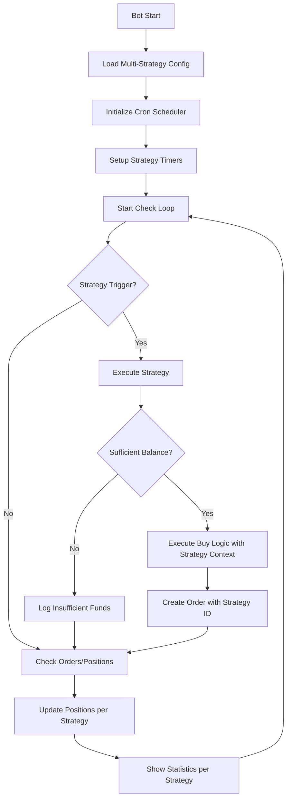

# Architecture : Stratégies Multiples avec Planification Cron

## 📋 Analyse d'Impact Architectural

### Composants Existants Impactés

**1. Configuration [`internal/core/config/config.go`](internal/core/config/config.go:1)**
- ❌ **Structure actuelle** : Configuration monolithique pour une seule stratégie
- ✅ **Nouvelle structure** : Array de stratégies avec paramètres individuels + cron scheduling

**2. Bot Logic [`internal/bot/bot.go`](internal/bot/bot.go:1)**
- ❌ **Logique actuelle** : Timers fixes (`BuyInterval`, `CheckInterval`) 
- ✅ **Nouvelle logique** : Scheduler cron + exécution de stratégies multiples

**3. Base de données [`internal/core/database/database.go`](internal/core/database/database.go:1)**
- ❌ **Schéma actuel** : Orders/Positions sans référence à la stratégie
- ✅ **Nouveau schéma** : Ajouter `strategy_id` pour tracking

**4. Interface Web**
- ❌ **Vue actuelle** : Statistiques globales
- ✅ **Nouvelle vue** : Statistiques par stratégie + vue d'ensemble

## 🏗️ Nouvelle Structure de Configuration Proposée

### Format YAML Multi-Stratégies

```yaml
# Trading Bot Configuration with Multiple Strategies
exchange:
  name: hyperliquid

# Global settings (shared by all strategies)
global:
  pair: UBTC/USDC
  check_interval_minutes: 5

# Database configuration
database:
  path: db/bot.db

# Logging configuration
logging:
  level: info
  file: ""

# Web server configuration
web:
  port: ":8080"

# Array of strategies with individual cron schedules
strategies:
  - name: "Daily Conservative"
    description: "1x/jour, RSI<30, +10% profit"
    enabled: true
    cron: "0 9 * * *"                    # Une fois par jour à 9h
    quote_amount: 15.0
    rsi_threshold: 30.0
    rsi_period: 14
    profit_target: 10.0
    volatility_period: 7
    volatility_adjustment: 50.0
    trailing_stop_delta: 0.1
    sell_offset: 0.1
    max_concurrent_orders: 1
    
  - name: "Monthly Aggressive" 
    description: "1x/mois, RSI<30, +100% profit"
    enabled: true
    cron: "0 10 1 * *"                   # Le 1er de chaque mois à 10h
    quote_amount: 50.0
    rsi_threshold: 30.0
    rsi_period: 14
    profit_target: 100.0
    volatility_period: 7
    volatility_adjustment: 20.0
    trailing_stop_delta: 0.5
    sell_offset: 0.1
    max_concurrent_orders: 1
    
  - name: "Scalping"
    description: "4x/jour, RSI<70, +2% profit"  
    enabled: true
    cron: "0 */6 * * *"                  # Toutes les 6h
    quote_amount: 25.0
    rsi_threshold: 70.0
    rsi_period: 14
    profit_target: 2.0
    volatility_period: 7
    volatility_adjustment: 100.0
    trailing_stop_delta: 0.1
    sell_offset: 0.1
    max_concurrent_orders: 2
```

## 📊 Modifications de la Base de Données

### Schema Changes

```sql
-- Nouvelle table strategies
CREATE TABLE strategies (
  id INTEGER PRIMARY KEY AUTOINCREMENT,
  name TEXT UNIQUE NOT NULL,
  description TEXT,
  config TEXT NOT NULL,  -- JSON config de la stratégie
  enabled BOOLEAN DEFAULT 1,
  created_at DATETIME DEFAULT CURRENT_TIMESTAMP,
  updated_at DATETIME DEFAULT CURRENT_TIMESTAMP
);

-- Modifier table orders pour ajouter strategy_id
ALTER TABLE orders ADD COLUMN strategy_id INTEGER REFERENCES strategies(id);

-- Modifier table positions pour ajouter strategy_id  
ALTER TABLE positions ADD COLUMN strategy_id INTEGER REFERENCES strategies(id);

-- Modifier table cycles pour ajouter strategy_id
ALTER TABLE cycles ADD COLUMN strategy_id INTEGER REFERENCES strategies(id);

-- Index pour les performances
CREATE INDEX idx_orders_strategy_id ON orders(strategy_id);
CREATE INDEX idx_positions_strategy_id ON positions(strategy_id);
CREATE INDEX idx_cycles_strategy_id ON cycles(strategy_id);
```

## 🏛️ Nouvelles Structures Go

### Configuration Structures

```go
// Nouvelle structure pour une stratégie individuelle
type Strategy struct {
    Name                 string  `yaml:"name" json:"name"`
    Description          string  `yaml:"description,omitempty" json:"description,omitempty"`
    Enabled              bool    `yaml:"enabled" json:"enabled"`
    Cron                 string  `yaml:"cron" json:"cron"`
    QuoteAmount          float64 `yaml:"quote_amount" json:"quote_amount"`
    RSIThreshold         float64 `yaml:"rsi_threshold" json:"rsi_threshold"`
    RSIPeriod            int     `yaml:"rsi_period" json:"rsi_period"`
    ProfitTarget         float64 `yaml:"profit_target" json:"profit_target"`
    VolatilityPeriod     int     `yaml:"volatility_period" json:"volatility_period"`
    VolatilityAdjustment float64 `yaml:"volatility_adjustment" json:"volatility_adjustment"`
    TrailingStopDelta    float64 `yaml:"trailing_stop_delta" json:"trailing_stop_delta"`
    SellOffset           float64 `yaml:"sell_offset" json:"sell_offset"`
    MaxConcurrentOrders  int     `yaml:"max_concurrent_orders" json:"max_concurrent_orders"`
}

// Structure de configuration globale
type GlobalConfig struct {
    Pair                 string `yaml:"pair" json:"pair"`
    CheckIntervalMinutes int    `yaml:"check_interval_minutes" json:"check_interval_minutes"`
}

// Nouvelle structure de configuration complète
type MultiStrategyConfig struct {
    Exchange struct {
        Name string `yaml:"name" json:"name"`
    } `yaml:"exchange" json:"exchange"`
    
    Global GlobalConfig `yaml:"global" json:"global"`
    
    Database struct {
        Path string `yaml:"path" json:"path"`
    } `yaml:"database" json:"database"`
    
    Logging struct {
        Level string `yaml:"level" json:"level"`
        File  string `yaml:"file,omitempty" json:"file,omitempty"`
    } `yaml:"logging" json:"logging"`
    
    Web struct {
        Port string `yaml:"port" json:"port"`
    } `yaml:"web" json:"web"`
    
    Strategies []Strategy `yaml:"strategies" json:"strategies"`
}
```

## ⚡ Nouveau Flow d'Exécution



## 🔧 Nouveaux Composants à Implémenter

### 1. Cron Scheduler
- **Package**: `internal/scheduler`
- **Responsabilité**: Gérer les déclenchements selon les expressions cron
- **Interface**: 
  ```go
  type Scheduler interface {
      AddStrategy(id string, cron string, callback func())
      Start()
      Stop()
  }
  ```

### 2. Strategy Manager
- **Package**: `internal/strategy` 
- **Responsabilité**: Orchestrer l'exécution des stratégies
- **Interface**:
  ```go
  type Manager interface {
      ExecuteStrategy(strategy Strategy) error
      GetActiveStrategies() []Strategy
      IsStrategyActive(name string) bool
  }
  ```

### 3. Resource Manager
- **Package**: `internal/resource`
- **Responsabilité**: Gérer les conflits de balance (premier arrivé, premier servi)
- **Interface**:
  ```go
  type ResourceManager interface {
      ReserveBalance(amount float64) (bool, error)
      ReleaseBalance(amount float64) error
      GetAvailableBalance() (float64, error)
  }
  ```

### 4. Strategy Validator
- **Package**: `internal/validator`
- **Responsabilité**: Valider les configurations et détecter les conflits
- **Interface**:
  ```go
  type Validator interface {
      ValidateStrategy(strategy Strategy) error
      ValidateConfig(config MultiStrategyConfig) error
      DetectConflicts(strategies []Strategy) []string
  }
  ```

## ⚠️ Défis Techniques Identifiés

### 1. Race Conditions
- **Problème**: Plusieurs stratégies qui se déclenchent simultanément
- **Solution**: Mutex sur les opérations critiques + queue de traitement

### 2. Balance Management
- **Problème**: Gérer l'allocation dynamique des fonds
- **Solution**: ResourceManager avec locks atomiques

### 3. RSI Calculation Optimization
- **Problème**: Éviter de recalculer le RSI pour chaque stratégie
- **Solution**: Cache avec TTL basé sur les périodes RSI utilisées

### 4. Migration des Configurations Existantes
- **Problème**: Convertir les configurations mono-stratégie existantes
- **Solution**: Migration automatique au premier démarrage

## 🎯 Avantages du Système Proposé

- ✅ **Flexibilité maximale**: Chaque stratégie a ses propres paramètres
- ✅ **Scheduling précis**: Syntaxe cron standard pour planification
- ✅ **Pool partagé simple**: Pas de complexité d'allocation fixe
- ✅ **Extensibilité**: Facile d'ajouter de nouvelles stratégies
- ✅ **Monitoring**: Tracking des performances par stratégie
- ✅ **Backward Compatibility**: Migration automatique des anciennes configs

## 📈 Plan d'Implémentation

### Phase 1: Core Architecture
1. Refactoriser les structures de configuration
2. Implémenter le cron scheduler
3. Créer le strategy manager

### Phase 2: Database & Logic
1. Migrer le schéma de base de données
2. Refactoriser la logique du bot
3. Implémenter le resource manager

### Phase 3: UI & Monitoring
1. Mettre à jour l'interface web
2. Ajouter les statistiques par stratégie
3. Créer les outils de validation

### Phase 4: Testing & Migration
1. Tests de régression sur les anciennes configs
2. Tests de stress avec stratégies multiples
3. Documentation utilisateur

## 🔄 Migration Path

Pour assurer la compatibilité avec les configurations existantes, le système détectera automatiquement les anciennes configurations et les convertira :

```yaml
# Ancienne config sera convertie en:
strategies:
  - name: "Legacy Strategy"
    description: "Migrated from single-strategy config"
    enabled: true
    cron: "0 */4 * * *"  # Basé sur l'ancien buy_interval_hours
    # ... autres paramètres copiés
```

Cette architecture respecte vos exigences tout en conservant une implémentation gérable avec le pool partagé "premier arrivé, premier servi".